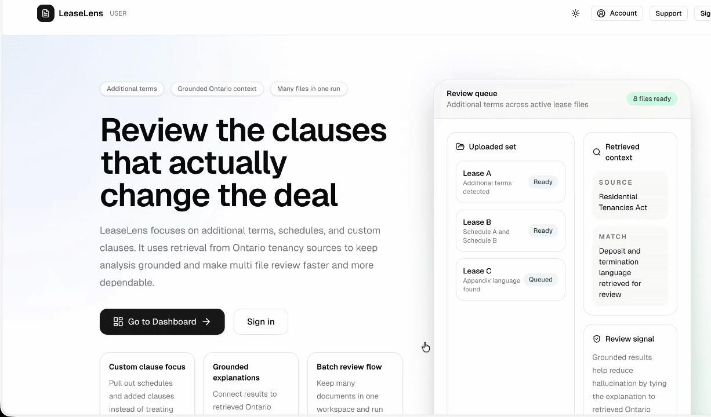
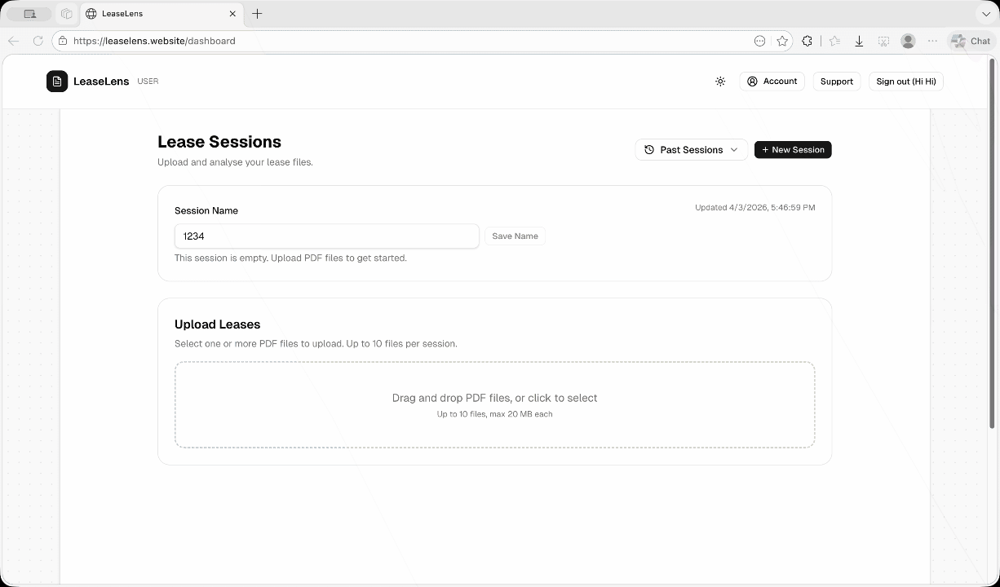
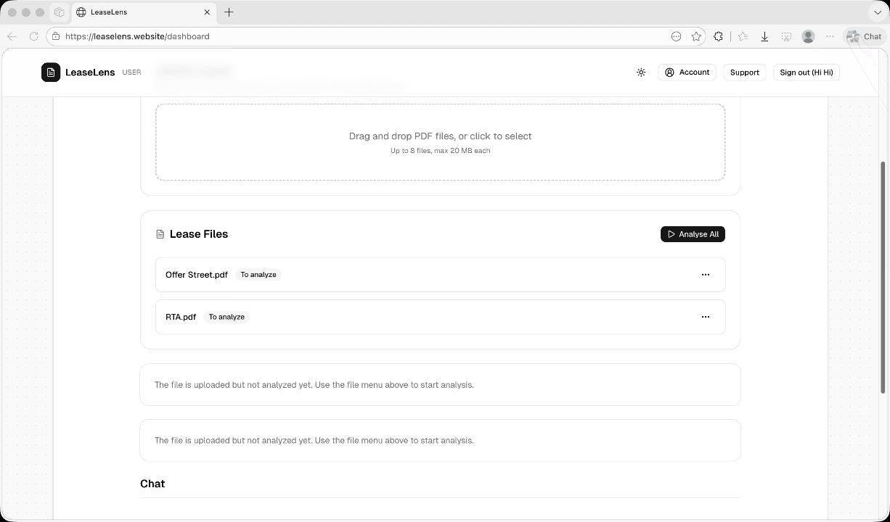
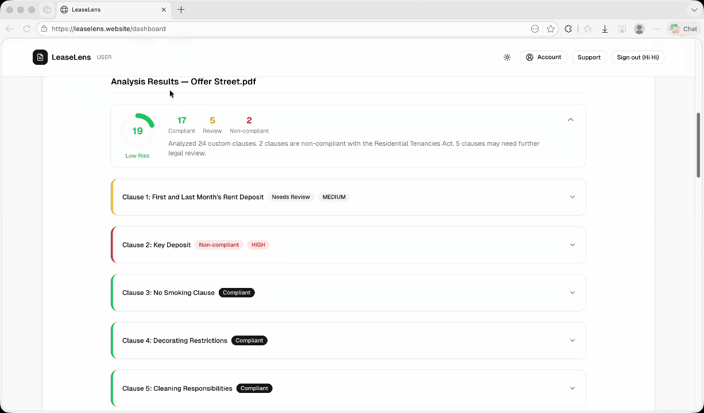
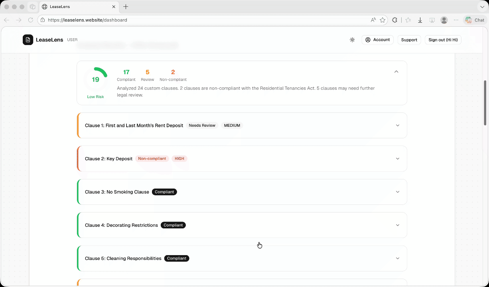
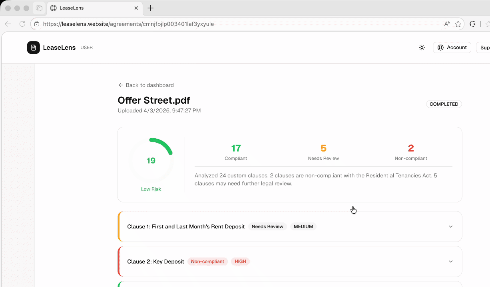
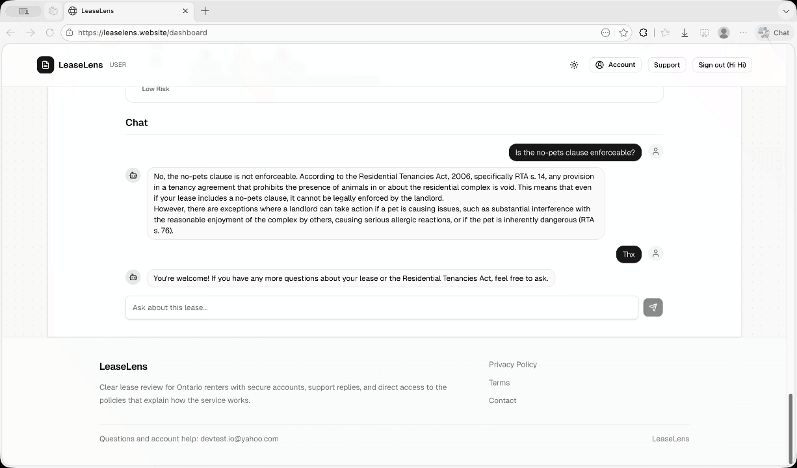
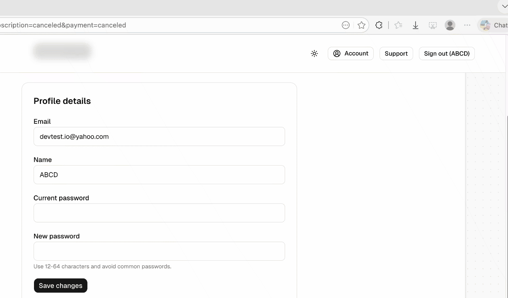
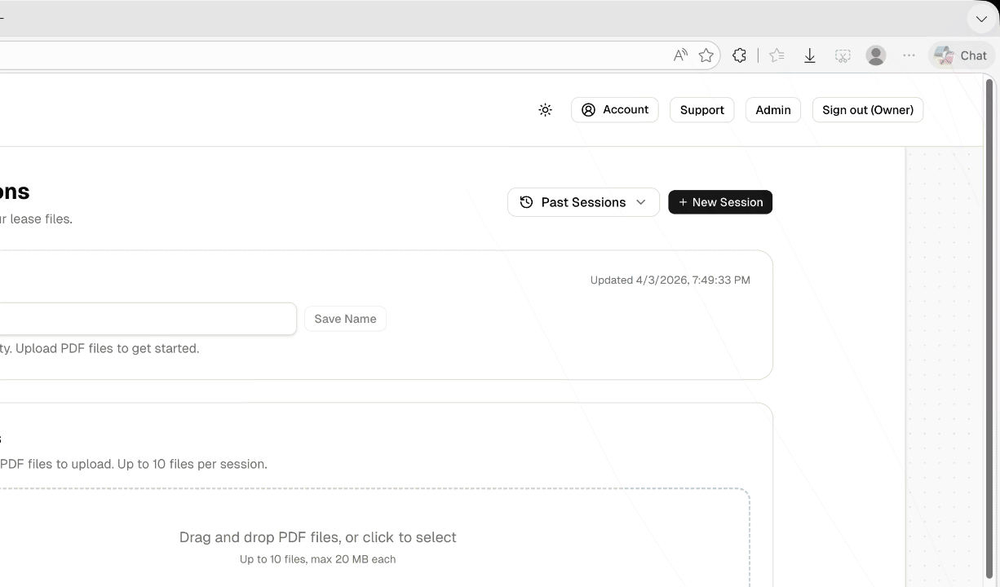

# LeaseLens
Live: https://leaselens.website/

## Table of Contents

- [Team Information](#team-information)
- [Video Demo](#video-demo)
- [Motivation](#motivation)
- [Objectives](#objectives)
- [Technical Stack](#technical-stack)
- [Features](#features)
- [User Guide](#user-guide)
- [Development Guide](#development-guide)
- [Deployment Information](#deployment-information)
- [Lessons Learned and Concluding Remarks](#lessons-learned-and-concluding-remarks)
- [Notable Technical Innovation](#notable-technical-innovation)
- [AI Assistance & Verification (Summary)](#ai-assistance--verification-summary)
- [Individual Contributions](#individual-contributions)

---

## Team Information

| Name         | Student Number | Email                          |
| ------------ | -------------- | ------------------------------ |
| Yiyang Liu   | 1011770512     | yiyang.liu@mail.utoronto.ca    |
| Zihan Wan    | 1011617779     | zihanzane.wan@mail.utoronto.ca |
| Kaiwei Zhang | 1007073872     | kwei.zhang@mail.utoronto.ca    |
| Ruiwu Liu    | 1011815332     | rev.liu@mail.utoronto.ca       |

---

## Video Demo

Watch the walkthrough here: [Demo](https://youtu.be/YbLZNCLEfiQ)

---

## Motivation

Ontario renters often sign lease agreements without knowing whether added clauses are enforceable under the Residential Tenancies Act (RTA). Many tenants only discover illegal fees, invalid pet restrictions, or unfair responsibilities after moving in. Reviewing lease language manually is slow, inconsistent, and difficult for students, newcomers, and busy renters who need fast, understandable guidance.

LeaseLens makes lease review clearer, faster, and more trustworthy for renters who want to understand risks before signing, landlords who want to catch problematic terms before disputes arise, and admin staff who need visibility into uploaded agreements and analysis activity. The product emphasizes clarity (upload, analyze, clause by clause results), legal grounding (RTA citations and compliance labels), and user ownership (account based access to agreements, saved history, and follow up chat/support flows). By turning dense legal text into structured, explainable analysis, LeaseLens helps users make better housing decisions without relying on guesswork or expensive manual review.

---

## Objectives

- Deliver a clear, web first lease review flow (authenticate, upload, analyze, view clause by clause results, follow up via chat/support) that reduces confusion around Ontario residential lease terms.
- Make compliance analysis trustworthy through backend driven document processing, clause extraction, RAG assisted legal retrieval, and structured LLM outputs tied to RTA citations, risk scores, and compliance labels.
- Empower users to self serve with secure account based access, per user agreement history, analysis detail pages, and chat/support tools for follow up questions.
- Give admins operational control with role based access to user management and internal support workflows.
- Provide secure authentication through email/password, JWT backed sessions, and Google OAuth, with role separation across standard users, admins, and owners.
- Align with the course implementation stack: Next.js App Router, TypeScript, Prisma, PostgreSQL, Redux Toolkit, AWS S3, and OpenAI powered analysis, deployed as a full stack web application.

---

## Technical Stack

1. Frontend framework: Next.js 15 with App Router, React 19, and TypeScript for a multi-page
   web application covering authentication, dashboard, agreement detail, account, admin, chat,
   and support flows.
2. UI and styling: Tailwind CSS v4, shadcn/ui, and reusable feature components for upload,
   analysis result cards, risk visualization, and account/admin panels.
3. State management: Redux Toolkit for client-side app state, especially around authenticated
   user/session data and subscription-related state.
4. Backend architecture: Next.js API routes serve as the application backend for auth,
   agreements, analyses, uploads, support threads, chat sessions, and Stripe billing flows.
5. Database and ORM: PostgreSQL with Prisma ORM stores users, sessions, agreements, analyses,
   clause results, support threads, chat history, presets, and RTA retrieval chunks.
6. Authentication and authorization: Email/password auth with JWT/session utilities, Google
   OAuth, and role-based access control for USER, ADMIN, and OWNER permissions.
7. AI and legal analysis: Vercel AI SDK plus OpenAI models power clause evaluation, while
   custom RAG utilities and embedded RTA chunks ground outputs in Ontario tenancy law.
8. Document handling and storage: Lease files are uploaded through presigned URLs and stored in
   AWS S3; PDF parsing and clause extraction utilities prepare agreement text for downstream
   analysis.
9. Payments and subscriptions: Stripe checkout, customer portal, and webhook handlers support
   subscription-aware product logic.
10. Validation and supporting libraries: Zod for request/data validation, along with utility
    modules for rate limiting, email flows, password reset, and shared server-side helpers.

## Features

### Ⅰ. Application Features

#### Authentication and Account Management

**Email/Password and Google OAuth Authentication**: Users can register with email/password credentials or use Google OAuth for single click authentication. JWT backed session management keeps users authenticated across requests, and protected pages redirect unauthenticated visitors to login.

**Password Reset with Email Verification**: Users recover accounts by entering their email, receiving a verification code (via AWS SES), and setting a new password without contacting support.

**Role Based Access Control (RBAC)**: Three roles (USER, ADMIN, OWNER) govern visibility and permissions. Standard users manage their own agreements and chat sessions, admins access user management and support oversight, and owners have full platform control.

**Account Settings and Self Service Profile Management**: Users can update their display name, email, and password from a dedicated account page. A "Danger Zone" section allows permanent account deletion with password confirmation and a typed "DELETE" safeguard.

#### Lease Upload and Document Management

**Drag and Drop Multi File Upload**: The dashboard provides a drag and drop zone (with a click to select fallback) accepting multiple PDF lease files per session, up to 20 files and 20 MB each. Files upload to AWS S3 through presigned URLs with server side size enforcement and rate limiting.

**Session Based Organization**: Every upload belongs to a named session. Users can create, rename, switch between, and delete sessions along with all associated files and results.

**Per File Status Tracking**: Each uploaded agreement displays a real time status badge (PENDING, PROCESSING, COMPLETED, or FAILED) so users always know where their documents stand.

#### AI Powered Lease Analysis

**Clause Extraction and Compliance Evaluation**: Users can trigger analysis on individual files or use "Analyze All" to batch process every pending document. The backend extracts clauses from PDF text, evaluates each against the Ontario RTA using a RAG retrieval pipeline with pgvector embeddings, and returns structured results through OpenAI powered LLM orchestration (GPT 4o mini for clause evaluation, GPT 4o for chat).

**Risk Score Visualization**: A circular risk score ring (0 to 100) provides an at a glance severity indicator, color coded green (low), amber (medium), or red (high), so users can immediately gauge overall compliance health.

**Clause by Clause Result Cards**: Each extracted clause appears in an expandable card showing compliance status (Compliant, Non Compliant, or Needs Review), severity level, and three tabs: overview (clause text and AI explanation), details (RTA citations and legal basis), and suggestion (recommended actions).

**Compliance Summary**: Aggregate counts of compliant, non compliant, and needs review clauses appear alongside an AI generated summary, giving users a quick compliance snapshot.

#### Conversational Followup (Chat)

**Session Scoped Streaming Chat**: Within any session, users can ask freeform questions about their uploaded leases. The AI assistant responds in real time via streaming, grounded in the session's agreement content and RAG retrieved RTA context. Chat history persists across page reloads.

**Suggested Questions**: Quick select prompts (e.g., "Is the no pets clause enforceable?") help users start meaningful conversations immediately.

#### Admin and Support

**Admin User Management Panel**: Admins and owners can view all registered users, see verification status, change roles (with hierarchy constraints), and remove accounts.

**Support Ticket System**: Users can open support threads with a subject and message. Admins and owners see all threads and can reply; standard users see only their own. Threads track status (open/closed), direction, and timestamps.

#### Subscription and Billing

**Stripe Integrated Pro Subscription**: Users can upgrade to Pro through Stripe Checkout from the account page. Active subscribers see a "Pro" badge and can manage billing through the Stripe customer portal.

#### Landing Page and Theme

**Auth Aware Landing Page**: The public landing page presents the product value proposition with feature showcases. Authenticated users see "Go to Dashboard" while guests see "Get Started."

**Dark/Light Theme Toggle**: A theme switcher on both public and dashboard navigation bars lets users choose their preferred visual mode.

### Ⅱ. How Features Fulfill Course Project Requirements

#### Core Technical Requirements

**1. TypeScript**
All frontend and backend code is written in TypeScript, including React components, Next.js API routes, Prisma queries, and Zod validation schemas.

**2. React / Next.js (App Router)**
Next.js 15 App Router with Server Components for data fetching and protected layouts, API Routes as the backend, and client components for interactive UI (upload zone, chat panel, analysis cards).

**3. Tailwind CSS and shadcn/ui**
All styling uses Tailwind CSS v4. UI primitives (buttons, cards, inputs, badges, dropdowns, tabs, collapsibles, toasts) come from shadcn/ui for a consistent, responsive design.

**4. PostgreSQL with Prisma ORM**
PostgreSQL stores all persistent data (users, sessions, agreements, analyses, clause results, support threads, chat messages, RTA embedding chunks, subscriptions). Prisma manages the schema, migrations, and type safe queries. The pgvector extension enables vector similarity search for RAG retrieval.

**5. Cloud Storage (AWS S3)**
Uploaded lease PDFs are stored in a private S3 bucket. Presigned URLs handle browser to S3 uploads and server side PDF text extraction during analysis.

#### Advanced Features

**1. User Authentication and Authorization**
Email/password registration, Google OAuth, JWT backed sessions, password reset with email verification codes, and three tier RBAC (USER, ADMIN, OWNER) with protected routes and per user data isolation.

**2. File Handling and Processing**
Lease PDFs undergo nontrivial server side processing: the backend retrieves the file from S3, extracts full text using pdf parse, segments individual clauses through pattern based extraction tailored to Ontario standard lease forms, then feeds each clause through the RAG + LLM analysis pipeline.

**3. Advanced State Management (Redux Toolkit)**
Redux Toolkit manages global client side state for authenticated user and session data, enabling consistent auth aware rendering across dashboard, navigation, and account components.

**4. Integration with External APIs and Services**
The application integrates with OpenAI (GPT 4o mini for clause analysis, GPT 4o for chat, text embedding ada 002 for RAG embeddings), AWS S3 (file storage via presigned URLs), AWS SES (password reset emails), Stripe (checkout, subscriptions, webhooks), and Google OAuth.

### Ⅲ. How Features Achieve Project Objectives

**Clear, web first lease review flow**: A linear user journey (authenticate, upload, analyze, view clause by clause results, chat) within a single dashboard page reduces friction around Ontario residential lease terms.

**Trustworthy compliance analysis**: Backend driven document processing, clause extraction, RAG assisted retrieval against embedded RTA text, and structured LLM outputs produce clause results with explicit RTA citations, compliance labels, severity ratings, and risk scores.

**User self service**: Each user has their own agreement history organized by sessions, detailed analysis pages, and persistent chat threads, all accessible without admin intervention.

**Admin operational control**: Role based access gives admins and owners a user management panel and full visibility into all support threads.

**Secure authentication and authorization**: Email/password credentials, JWT backed sessions, Google OAuth, and three tier role separation (USER, ADMIN, OWNER) ensure every route, API endpoint, and query is scoped to the authenticated user's identity and permissions.

**Alignment with course implementation stack**: Built on Next.js 15 App Router, TypeScript, Prisma, PostgreSQL, Redux Toolkit, AWS S3, and OpenAI, deployed as a containerized full stack web application on AWS EC2.

---

## User Guide

> **Quick Test:**
>
> - To test the app without local setup, visit the live deployment at [https://leaselens.website/](https://leaselens.website/).
> - For local development, follow the setup instructions in [Development Guide](#development-guide).

### Registration and Login

LeaseLens supports both email/password registration and Google OAuth sign in. After creating an account or logging in, you are redirected to the dashboard. If you already have an account, use your credentials or click the Google sign in button. New users can sign up with an email, display name, and a password (12 to 64 characters).


---

### Forgot Password

If you forget your password, click "Forgot password?" on the login page. Enter your registered email to receive a verification code via email, then enter the code and set a new password.


---

### Dashboard Overview

The dashboard is the main workspace where all lease review activity takes place. It is organized around **sessions**. Each session groups uploaded lease files, their analysis results, and a follow up chat conversation.

- Use the **"New Session"** button to start a fresh review
- Use the **"Past Sessions"** dropdown to switch between previous sessions
- Rename a session by editing its title
- Delete a session using the trash icon (this removes all associated files and results)



---

### Uploading Lease Documents

Within an active session, drag and drop one or more PDF lease files into the upload zone, or click to open a file picker. Each session supports up to 20 files, with a maximum size of 20 MB per file. After upload, files appear in the agreement list with a PENDING status badge.



---

### Running AI Analysis

Once files are uploaded, you can:

- Click **"Analyze All"** to analyze every pending or failed file in the session at once
- Use the per file dropdown menu to start, retry, or cancel analysis on individual files

Analysis status updates automatically every few seconds. When processing completes, the results appear directly below the agreement list.



---

### Viewing Analysis Results

After analysis completes, the dashboard displays:

- **Risk Score Ring**: A circular gauge (0 to 100) showing the overall risk level, color coded from green (low) to red (high)
- **Compliance Summary**: Counts of compliant, non compliant, and needs review clauses
- **Overall Summary**: An AI generated paragraph summarizing the lease's compliance posture
- **Clause Cards**: Expandable cards for each extracted clause, showing:
  - Compliance badge and severity level
  - **Overview** tab: clause text and AI explanation
  - **Details** tab: RTA citations and legal basis
  - **Suggestion** tab: recommended actions

Click on any clause card to expand it and view the full analysis.



---

### Agreement Detail Page

Click **"View Results"** in the per file dropdown menu to open a dedicated detail page for a single agreement. This page provides the same risk score, compliance summary, and clause by clause cards in a full page layout, along with the file name, upload timestamp, and current status.



---

### Chat with AI Assistant

At the bottom of the dashboard, a chat panel lets you ask follow up questions about your uploaded leases. The AI assistant uses the session's agreement content and Ontario RTA legal references to provide grounded answers.

- Type a question in the input field and press Send
- Or select one of the **suggested questions** (e.g., "Is the no pets clause enforceable?")
- Chat history is saved and persists when you revisit the session



---

### Account Settings

Access your account settings from the navigation bar. From this page you can:

- **Update profile**: Change your display name or email
- **Change password**: Enter your current password and set a new one
- **Manage subscription**: Upgrade to Pro via Stripe Checkout, or manage an existing subscription through the Stripe billing portal
- **Delete account**: Permanently remove your account by confirming your password and typing "DELETE"



---

### Support (All Users)

Click the **Support** link in the navigation bar to open the support inbox. From here you can:

- Create a new support thread by entering a subject and message
- View your existing threads and their current status (Open or Closed)
- Select a thread to see the full message history and send replies



---

### Admin Features (Admin and Owner Only)

Admin and Owner users see an additional **Admin** link in the navigation bar, which opens the user management panel.

#### User Management

Admins can view all registered users along with their email verification status and current role. Available actions include:

- **Change Role**: Promote or demote users between USER, ADMIN, and OWNER (subject to role hierarchy)
- **Delete User**: Remove a user account from the platform (with confirmation)



## Development Guide

For detailed API endpoint documentation, see the [API Reference](project-docs/api.md).

LeaseLens is a Next.js 15 + TypeScript application backed by PostgreSQL/Prisma, AWS S3, and OpenAI. Follow the steps below to set up a local development environment.

1.  Environment setup and configuration
    - Prerequisites: Node.js 20+, npm, and PostgreSQL 14+ (if using a local database).
    - Clone the repository, enter the project folder, and install dependencies:
      ```bash
      git clone https://github.com/zane-wan/LeaseLens.git
      cd LeaseLens
      npm install
      ```
    - Copy `.env.example` to `.env.local`, since the application, Prisma config, Vitest setup,
      and ingestion scripts all load local configuration from `.env.local`:
      ```bash
      cp .env.example .env.local
      ```
    - Fill in the required variables (see sections below for each):
      - `DATABASE_URL` — PostgreSQL connection string
      - `OPENAI_API_KEY` — for lease analysis and embeddings (step 5)
      - `AWS_ACCESS_KEY_ID`, `AWS_SECRET_ACCESS_KEY`, `AWS_S3_BUCKET`, `AWS_REGION` — file storage (step 3)
      - `JWT_SECRET` — generate with `openssl rand -base64 32`
      - `GOOGLE_CLIENT_ID`, `GOOGLE_CLIENT_SECRET`, `NEXT_PUBLIC_APP_URL` — Google OAuth (step 4)
      - `STRIPE_*` — only needed for subscription flows

2.  Database initialization

    **Option A: Shared AWS RDS (recommended for team members)**

    Use the shared AWS RDS instance (already contains schema and seeded RTA data). Obtain the `DATABASE_URL` from the team, then run:
    ```bash
    npx prisma generate
    ```

    **Option B: Local PostgreSQL (standalone development)**

    Create a local PostgreSQL database with the pgvector extension (required for the `RtaChunk` table storing 1536 dimensional embeddings):
    ```bash
    # macOS (Homebrew)
    brew install postgresql@17 pgvector
    brew services start postgresql@17

    # Ubuntu/Debian
    sudo apt install postgresql postgresql-17-pgvector

    # Create the database
    createdb leaselens
    ```
    Set `DATABASE_URL` in `.env.local` (adjust the username to match your local PostgreSQL user):
    ```
    DATABASE_URL=postgresql://your_username@localhost:5432/leaselens
    ```
    Apply the schema migrations and generate the Prisma client:
    ```bash
    npx prisma migrate dev
    npx prisma generate
    ```
    The migration at `20260316204527_add_rta_chunk_model` automatically runs
    `CREATE EXTENSION IF NOT EXISTS "vector"`, so pgvector must be installed before this step.

    If the local database lacks RTA retrieval data, run the ingestion script (parses `data/rta-full-text.txt`, generates OpenAI embeddings, stores `RtaChunk` records):
    ```bash
    npx tsx scripts/ingest-rta.ts
    ```
    Note: this script requires a valid `OPENAI_API_KEY` in `.env.local` and costs approximately $0.02 to run.

3.  Cloud storage configuration (AWS S3)

    A working S3 bucket and IAM credentials are required for upload testing.

    1. Create an S3 bucket (e.g. `leaselens-dev`) with **all public access blocked**.
    2. Configure CORS on the bucket to allow `PUT` requests from `http://localhost:3000`:
       ```json
       [
         {
           "AllowedHeaders": ["*"],
           "AllowedMethods": ["PUT"],
           "AllowedOrigins": ["http://localhost:3000"],
           "ExposeHeaders": ["ETag"],
           "MaxAgeSeconds": 3600
         }
       ]
       ```
    3. Create an IAM user with a scoped policy allowing `s3:PutObject`, `s3:GetObject`, and
       `s3:DeleteObject` on the bucket.
    4. Set the credentials in `.env.local`:
       ```
       AWS_ACCESS_KEY_ID=AKIA...
       AWS_SECRET_ACCESS_KEY=...
       AWS_S3_BUCKET=leaselens-dev
       AWS_REGION=us-east-1
       ```
    5. Validate connectivity with the included test script:
       ```bash
       npx tsx scripts/test-s3-upload.ts
       ```

4.  Google OAuth configuration

    Optional for local development; required to test "Sign in with Google."

    1. In [Google Cloud Console](https://console.cloud.google.com/), create a project and configure the **OAuth consent screen** (External audience, scopes: `openid`, `email`, `profile`). Add your email as a test user.
    2. Under **Credentials**, create an **OAuth client ID** (Web application) with:
       - Authorized JavaScript origins: `http://localhost:3000`
       - Authorized redirect URIs: `http://localhost:3000/api/auth/google/callback`
    3. Copy the Client ID and Client Secret into `.env.local`:
       ```
       GOOGLE_CLIENT_ID=123456789-xxxxxxxxxx.apps.googleusercontent.com
       GOOGLE_CLIENT_SECRET=GOCSPX-xxxxxxxxxxxxxxxx
       NEXT_PUBLIC_APP_URL=http://localhost:3000
       ```

5.  OpenAI API key

    An OpenAI API key is required for lease analysis (GPT 4o mini for clause evaluation,
    GPT 4o for chat) and embedding generation (text embedding ada 002). API access requires
    a paid OpenAI account.

    1. Sign up at [platform.openai.com](https://platform.openai.com/signup) and add a payment
       method under Billing.
    2. Add $5 credit (sufficient for extensive development; typical per lease analysis costs
       approximately $0.05 to $0.10).
    3. Generate an API key at [platform.openai.com/api-keys](https://platform.openai.com/api-keys)
       and add it to `.env.local`:
       ```
       OPENAI_API_KEY=sk-proj-...
       ```

6.  Stripe configuration (optional)

    Only needed for local subscription/billing testing. Create a [Stripe test mode](https://dashboard.stripe.com/test/apikeys) account and fill in `STRIPE_SECRET_KEY`, `STRIPE_PUBLISHABLE_KEY`, `STRIPE_PRO_PRICE_ID`, and `STRIPE_WEBHOOK_SECRET` in `.env.local`. Without these, subscription features are simply unavailable.

7.  Email configuration (optional)

    Password reset emails use AWS SES in production. Locally, `EMAIL_MODE=console` (the default) prints verification codes to the terminal. The remaining email variables in `.env.example` (`SMTP_USER`, `SMTP_PASS`, `SMTP_HOST`, `SMTP_PORT`, `SMTP_SECURE`, `SUPPORT_FROM_EMAIL`) are only used when `EMAIL_MODE` is `ses` or `smtp` and can be left empty for local development.

    > **Note for TA / evaluators:** The production AWS SES account is currently in **sandbox
    > mode** (AWS declined the production access request). This means password reset emails can
    > only be delivered to email addresses that have been manually added to the SES verified
    > identities list. If you would like to test the password reset flow on the deployed
    > application, please contact zihanzane.wan@mail.utoronto.ca to have your email address
    > added to the SES identity list.

8.  Local development and testing
    - Start the application and open `http://localhost:3000`:
      ```bash
      npm run dev
      ```
    - Use `npm run lint` to check code quality and `npm test` to run the Vitest suite.
    - Integration tests (e.g. RAG retrieval checks) require live `DATABASE_URL` and
      `OPENAI_API_KEY` values, since they query the real database and embeddings pipeline.
    - Use `npx prisma studio` to browse and inspect database records through a GUI.

> **Credentials sent to TA.** All required environment credentials (API keys, database URL,
> AWS credentials, OAuth secrets) have been submitted to the TA via password protected archive
> as instructed.

## Deployment Information

The production application is built from the repository `Dockerfile` as a multi stage Next.js 15 standalone image and started on an AWS EC2 instance via `docker compose up -d --build`. The container is stateless; PostgreSQL runs on a shared AWS RDS instance, and lease PDFs are stored in a private S3 bucket served through presigned URLs. The production environment also requires Google OAuth credentials, SES email delivery, and Stripe secrets.

Deployment is automated in `.github/workflows/deploy.yml`. On each push to `main`, GitHub Actions writes production environment variables from repository secrets onto the EC2 host, then uses AWS Systems Manager (SSM) to pull code and rebuild the container. The public base URL is set via `NEXT_PUBLIC_APP_URL` (`https://leaselens.website`, no trailing slash).

## Lessons Learned and Concluding Remarks

This project reinforced that a focused scope is more valuable than a broad feature list. Limiting the legal domain to Ontario residential leases and building on a Next.js full stack architecture kept frontend, backend, and database work integrated rather than fragmented across disconnected systems.

The hardest parts were at integration boundaries rather than inside isolated modules. Authentication, S3 uploads, PostgreSQL persistence, LLM analysis, Stripe billing, and email delivery all worked individually, but making them reliable together required careful debugging of routing, environment variables, permissions, and deployment configuration. Privacy sensitive features like agreement access and support threads forced us to treat authorization as a server side concern throughout the application.

AI assistance was helpful but never sufficient on its own. AI was useful for brainstorming architectures, debugging, and drafting explanations, but many suggestions required correction to fit our codebase and course constraints. We verified outputs through manual testing, type checking, Prisma validation, and end to end feature checks.

Overall, LeaseLens gave us practical experience building a modern web application with real tradeoffs in product scope, security, deployment, and team coordination.

## Notable Technical Innovation

### Hybrid RAG Retrieval Pipeline for Legal Compliance Grounding

**Motivation:** Grounding lease clause analysis in the Ontario Residential Tenancies Act (RTA) requires retrieving the most relevant statutory provisions for each clause. Pure vector (semantic) search captures meaning but can miss exact legal terminology, while pure keyword search matches terms but misses semantically related provisions. For a legal compliance tool, both precision and recall matter: missing a relevant section undermines trust, and surfacing irrelevant ones adds noise.

**What was built:** The analysis backend implements Reciprocal Rank Fusion (RRF) combining two independent retrieval strategies over the same corpus of RTA statute chunks stored in PostgreSQL:

1. **Vector search** using pgvector cosine similarity over OpenAI `text-embedding-ada-002` embeddings (1536 dimensions), retrieving the top candidates by semantic closeness to the clause text.
2. **Keyword search** using PostgreSQL native full text search (`tsvector`/`plainto_tsquery`), retrieving the top candidates by lexical match.

Results from both strategies are merged using RRF scoring (`1 / (k + rank)` with `k = 60`), which produces a unified ranking without requiring score normalization across the two systems. The pipeline also supports category aware filtering so that retrieval can be scoped to specific areas of the Act. The implementation lives in `src/lib/rag.ts` and is invoked per clause during the analysis orchestration pipeline (`src/features/analysis/pipeline/orchestrator.ts`).

**Impact:** Analysis results include RTA citations that are grounded in both semantic relevance and exact terminology matching, which improves the trustworthiness and specificity of compliance labels, legal basis explanations, and suggested actions shown to users. The hybrid approach consistently surfaces provisions that either strategy alone would miss, particularly for clauses that use informal language to describe concepts defined formally in the Act.

## AI Assistance & Verification (Summary)

### Login, role control and part of UI/Dashboard design:

In this part, AI is used in the following ways:
- Code completion: Enabled by default in VS Code with default settings.
- UI/Dashboard template searching: Used GPT 5.4 to find highly rated UI/Dashboard templates, then manually reviewed, selected, and adapted the best fit for our project.
- Code commenting: After writing code, asked AI to add or polish comments to enhance readability for team collaboration.

### Landing page

For the landing page, I designed the overall view and layout manually. The images used inside the
page were AI-generated, and I integrated and adjusted them so that the final landing page fit
LeaseLens and worked correctly in our project.

### Backend pipeline, infrastructure, and integration

**Where AI meaningfully contributed:**

- **Architecture exploration:** Repository structure was discussed with AI to minimize merge conflicts across concurrent feature workstreams, informing the separation of feature directories, shared libraries, and API route conventions.
- **Debugging:** AI assisted with diagnosing Google OAuth login failures in production involving callback URL normalization (`app-url.ts`, `google/callback/route.ts`). Fixes shipped in commits `9b10a9d` and `8d09160`.
- **Code generation:** For features with well defined requirements (upload intent hardening, clause extraction, legal/privacy pages), AI generated initial implementations that were then human reviewed, revised, and integrated.

**Representative mistake:** AI initially suggested hardcoding the OAuth callback URL per environment rather than deriving it from the request origin, which would have broken the deployment workflow. We rejected this and built a URL normalization utility instead. See `ai-session.md` for the full session log.

**How correctness was verified:** All AI contributed code was validated through manual end to end testing (signup, OAuth login, upload, analysis, chat), Vitest unit and integration tests, Prisma schema validation, `tsc` type checking, and production smoke testing after each deployment.

---

## Individual Contributions

### Yiyang Liu

- Designed and implemented the database schema and Prisma models for core entities, including users,
  agreements, analyses, and related data relationships
- Implemented the drag-and-drop upload interface for lease documents
- Built client-side PDF parsing support as part of the upload workflow
- Contributed to the analysis results UI, including parts of the result display and user-facing
  analysis presentation

### Zihan Wan

- Implemented JWT/bcrypt authentication, signup/login/logout API routes, and Google OAuth with account linking
- Integrated AWS S3 for lease file storage with presigned URLs, upload rate limiting, and server side validation
- Built the RTA ingestion pipeline that parses statute text into pgvector embeddings stored in PostgreSQL as a vector database for RAG retrieval
- Implemented the clause extraction, RAG retrieval, and LLM analysis orchestration pipeline with structured compliance results and RTA citations
- Added streaming chat with RAG context grounding and unified the dashboard into a single page flow combining upload, batch analysis, results, and chat
- Set up AWS RDS as the shared team database, evolved the Prisma schema across migrations, and implemented Redux Toolkit for global auth state
- Created the Docker containerization, GitHub Actions CI/CD pipeline, and automated EC2 deployment with environment secret management

### Kaiwei Zhang

- Designed the homepage UI and contributed to the overall landing-page user experience
- Integrated frontend and backend components to support complete user interface workflows and resolved API-related issues during development
- Implemented session management features that allow users to revisit and access past sessions
- Integrated Stripe-based payment and subscription functionality for billing-related workflows

### Ruiwu Liu

- Built login, signup, Google OAuth, and password reset flows with role-based account controls.
- Developed protected dashboard pages for agreements, sessions, support threads, and account management.
- Developed and implemented AWS SES email service for verification code sending in reset password service.
- Added per-user access isolation, admin and owner permissions, and session persistence workflows.
